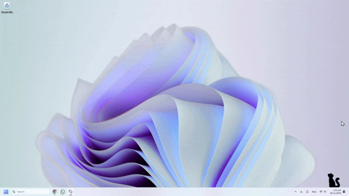
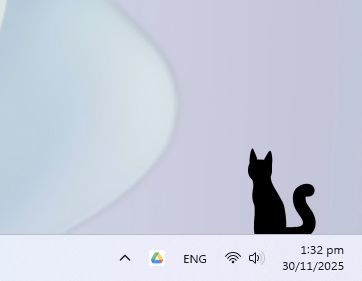

Taskbar Cat is an idea I've had since August 2024.

It was inspired by RunCat 360, a program that makes a running cat icon appear inside your Windows taskbar and goes faster depending on your cpu speed. My idea was more of a companion, not a pc monitor. I wanted to my OC, my character, watching me as I did whatever I was doing!

And now, just over a year later, I release Taskbar Cat for windows. A small (or large, if you change the size) cat that sits on top of your taskbar and watches you study, relax, and work.

You can
- Change the size
- Change the vertical and horizontal positions
- Set it to start on boot
And also easily uninstall or quit the program. To start/install it again, simply open the .exe file.

<a href="https://kattcrazy.nz/taskbar-cat/" style="display: inline-block; padding: 10px 20px; background-color:#8360F8; color: white; text-decoration: none; border-radius: 5px; font-weight: bold; transition: background-color 0.3s;">Download the .exe<a>

Microsoft Defender will  warn you when you try to install it, and say that it is unsafe. This is because I haven't gotten a signed certificate for it yet. I assure you, it's safe! If you still have doubts, you can take a look a the source code!

## Images

 

## Requirements
Windows 11

Taskbar NOT set to auto-hide

