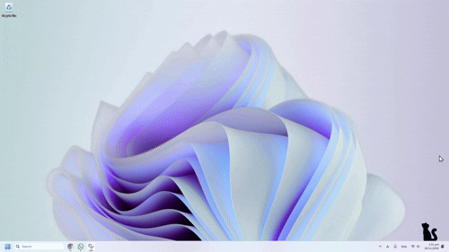
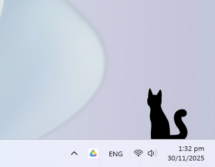

# Taskbar Cat

Taskbar Cat is an idea I've had since August 2024.

It was inspired by RunCat 360, a program that makes a running cat icon appear inside your Windows taskbar and goes faster depending on your cpu speed. My idea was more of a companion, not a pc monitor. I wanted a cat, watching me as I did whatever I was doing!

And now, just over a year later, I release Taskbar Cat for Windows. A small (or large, if you change the size) cat that sits on top of your taskbar and watches you study, relax, and work.

## Features

- Change the size of the cat
- Change the vertical and horizontal positions
- Choose monitor mode: primary monitor only or all monitors
- Auto start on boot (if enabled)
- Portable app behavior (no installer/uninstaller required)

## Images

 

## Requirements

- Windows 11
- Taskbar NOT set to auto-hide

## Development

```powershell
python -m pip install -r requirements.txt
pyinstaller taskbar_cat.spec
```

The release workflow automatically builds `TaskbarCat.exe` and uploads a `.sha256` checksum file for verification.

## Portable Usage

Taskbar Cat is intentionally portable:

- Run `TaskbarCat.exe` directly
- No installer is required
- To remove it, quit the app and delete the executable/folder
- If you enabled "Start on boot", disable that option from the tray menu before deleting
